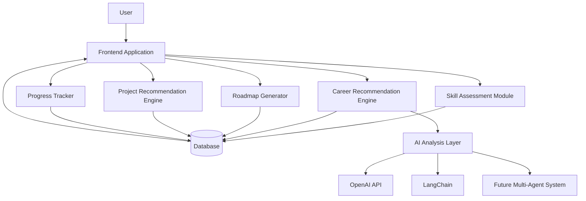
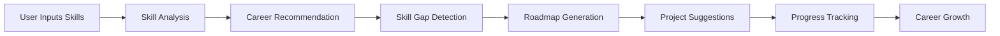

# AI Career Mentor 🚀

An AI-powered career guidance platform designed to help students and aspiring professionals discover the right technology career path, identify skill gaps, generate personalized learning roadmaps, and receive project recommendations based on their current knowledge and goals.

The platform acts as a virtual AI mentor, helping users navigate careers in Frontend Development, Backend Development, Data Analytics, DevOps, Cybersecurity, and Artificial Intelligence.

---

## 🌟 Project Overview

Choosing the right career path in technology can be overwhelming due to the vast number of skills, tools, and learning resources available today.

AI Career Mentor solves this problem by providing:

* Personalized career recommendations
* Skill gap analysis
* Learning roadmap generation
* Project recommendations
* Progress tracking
* AI-powered career guidance

Whether you are a beginner student or a working professional looking to switch domains, AI Career Mentor provides a structured path toward your goals.

---

# 🎯 Core Features

### 🔍 Skill Assessment Engine

Users enter:

* Education
* Current Skills
* Experience Level
* Career Interests

The system analyzes their profile and identifies:

* Existing strengths
* Missing skills
* Recommended career paths

---

### 🎓 Career Recommendation System

Provides:

* Best-matched career role
* Confidence score
* Required skills
* Learning priorities

Example:

```text
Recommended Career:
AI Engineer

Confidence:
87%

Missing Skills:
Python
Machine Learning
Deep Learning
NLP
LLMs
```

---

### 🗺️ AI Roadmap Generator

Creates personalized learning plans.

Example:

```text
Month 1
Python Fundamentals

Month 2
Data Structures & Algorithms

Month 3
Machine Learning

Month 4
Deep Learning

Month 5
NLP & LLMs

Month 6
Agentic AI Systems
```

---

### 💡 Project Recommendation Engine

Suggests projects based on current level.

#### Beginner

* Portfolio Website
* Weather App
* Resume Analyzer

#### Intermediate

* PDF Chatbot
* Recommendation System
* AI Career Advisor

#### Advanced

* Multi-Agent AI System
* Autonomous Research Assistant
* AI Career Mentor Pro

---

### 📊 Progress Tracking

Track:

* Skills Completed
* Projects Completed
* Learning Progress
* Career Readiness Score

---

# 🛠️ Supported Career Paths

## Frontend Developer

Skills:

* HTML5
* CSS3
* JavaScript
* React
* TypeScript
* Tailwind CSS
* Git & GitHub

---

## Backend Developer

Skills:

* Node.js
* Express.js
* Python
* FastAPI
* REST APIs
* SQL
* MongoDB

---

## Data Analyst

Skills:

* Excel
* SQL
* Python
* Pandas
* NumPy
* Power BI
* Tableau

---

## DevOps Engineer

Skills:

* Linux
* Docker
* Kubernetes
* CI/CD
* AWS
* Azure
* Monitoring Tools

---

## Cybersecurity Specialist

Skills:

* Networking
* Linux
* Ethical Hacking
* Wireshark
* Penetration Testing
* Security Auditing

---

## AI / ML Engineer

Skills:

* Python
* Mathematics
* Machine Learning
* Deep Learning
* NLP
* TensorFlow
* PyTorch
* LangChain
* LLMs
* Agentic AI

---

# 🏗️ System Architecture



---

# 🔄 Application Flow



---

# 📁 Project Structure

```text
ai-career-mentor/

├── frontend/
│
│   ├── public/
│   │
│   └── src/
│       ├── components/
│       ├── pages/
│       ├── services/
│       ├── data/
│       ├── hooks/
│       ├── types/
│       ├── App.tsx
│       └── main.tsx
│
├── backend/
│
│   ├── app/
│   │   ├── routes/
│   │   ├── services/
│   │   ├── models/
│   │   ├── schemas/
│   │   └── main.py
│
├── README.md
├── package.json
└── requirements.txt
```

---

# 💻 Tech Stack

## Frontend

* React
* TypeScript
* Tailwind CSS
* Vite

## Backend

* Python
* FastAPI

## Database

* SQLite
* PostgreSQL (Future)

## AI Layer

* OpenAI API
* LangChain
* Vector Database (Future)
* Agentic AI Architecture (Future)

## Version Control

* Git
* GitHub

---

# 🚀 Local Installation

## Clone Repository

```bash
git clone https://github.com/komaljawliya-tech/ai-career-mentor.git
```

## Enter Project Directory

```bash
cd ai-career-mentor
```
  
## Install Frontend Dependencies

```bash
npm install
```

## Start Frontend

```bash
npm run dev
```

---

## Backend Setup

Navigate to backend folder:

```bash
cd backend
```

Create virtual environment:

```bash
python -m venv venv
```

Activate environment:

```bash
venv\Scripts\activate
```

Install dependencies:

```bash
pip install -r requirements.txt
```

Run FastAPI server:

```bash
uvicorn app.main:app --reload
```

---

# 📤 Git Workflow

Stage changes:

```bash
git add .
```

Commit changes:

```bash
git commit -m "feat: implemented career recommendation engine"
```

Push to GitHub:

```bash
git push origin main
```

---

# 🛣️ Future Roadmap

### Phase 1

* Skill Assessment
* Career Recommendations
* Learning Roadmaps
* Project Suggestions

### Phase 2

* Resume Analysis
* Career Readiness Score
* Progress Dashboard

### Phase 3

* OpenAI Integration
* Personalized AI Mentor

### Phase 4

* LangChain Integration
* Memory System
* Context-Aware Guidance

### Phase 5

* Multi-Agent Career Coaching System
* Job Recommendation Engine
* Interview Preparation Assistant

---

# 📸 Screenshots

### Home Page

```text
(Add Screenshot Here)
```

### Skill Assessment

```text
(Add Screenshot Here)
```

### Career Recommendation Dashboard

```text
(Add Screenshot Here)
```

### Roadmap Generator

```text
(Add Screenshot Here)
```

---

# 🎓 Learning Outcomes

This project demonstrates:

* Frontend Development
* TypeScript Development
* React Architecture
* API Integration
* FastAPI Backend Development
* AI Application Design
* Career Recommendation Systems
* Agentic AI Foundations

---

# 📄 License

This project is licensed under the MIT License.

---

## 👨‍💻 Author

Komal

BCA Student | Frontend Developer in Progress | Aspiring AI Engineer

Building real-world projects and progressing toward AI Engineering through hands-on development, machine learning, NLP, and agentic AI systems.
